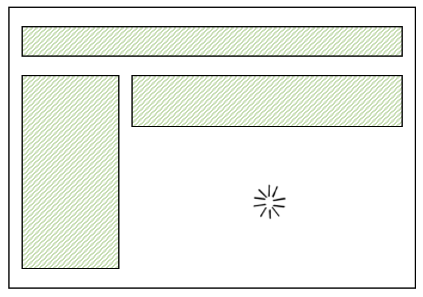
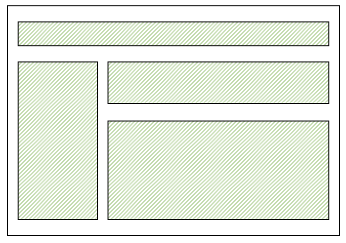
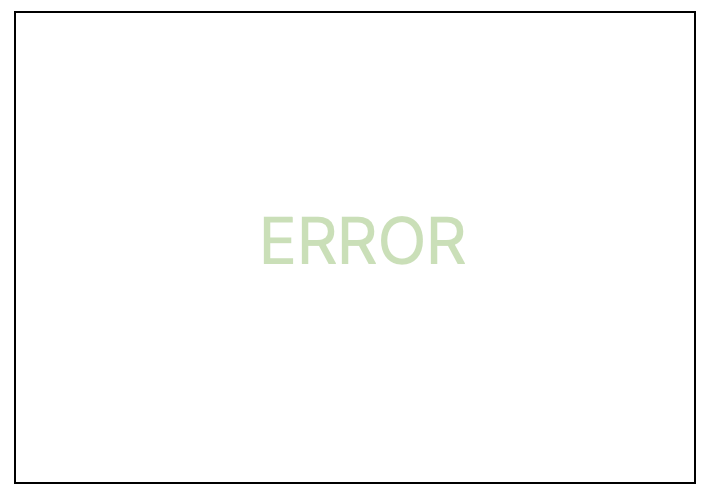
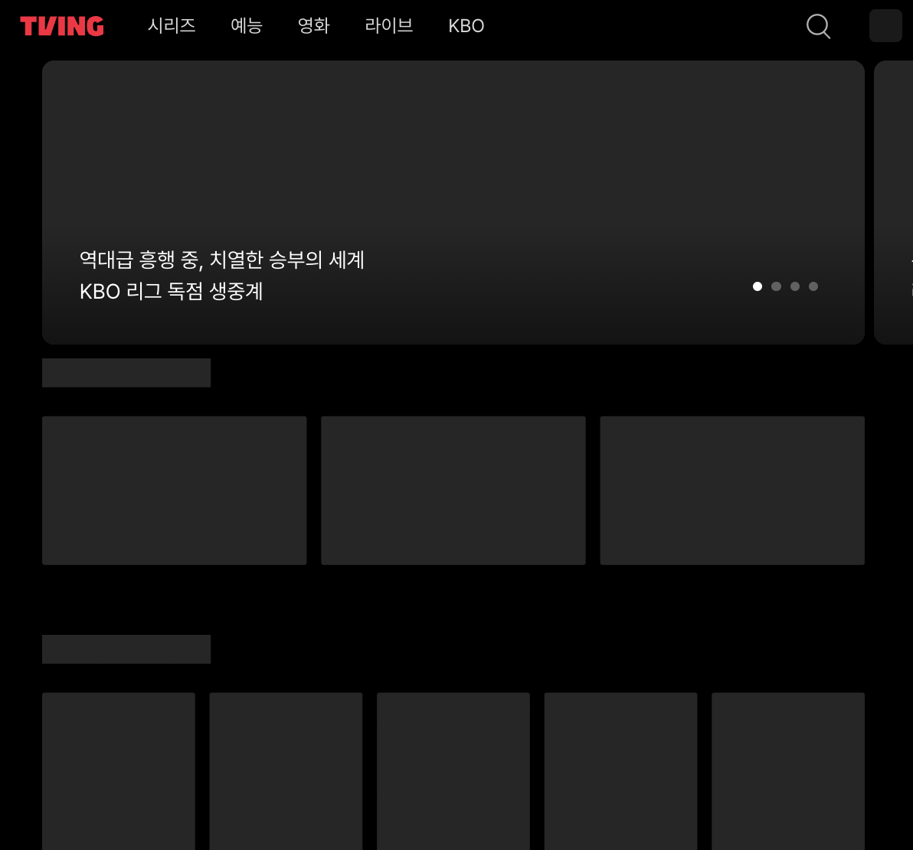
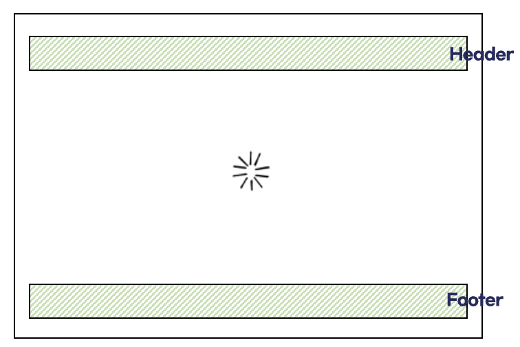
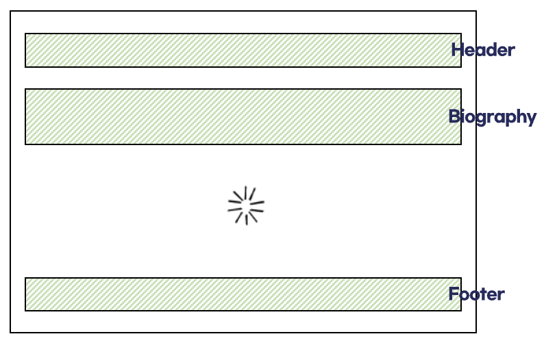
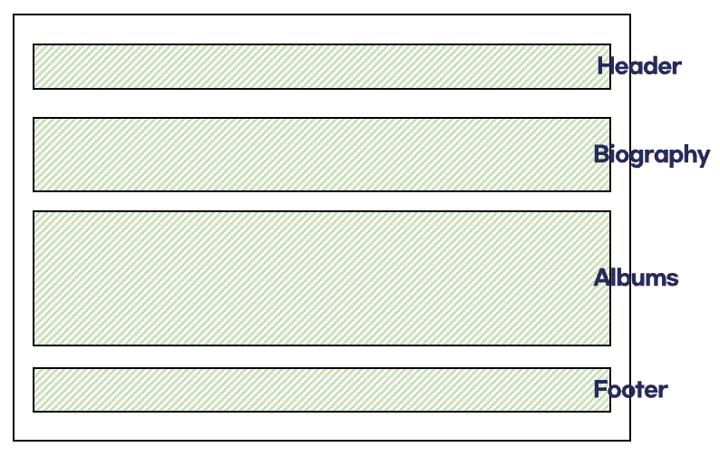
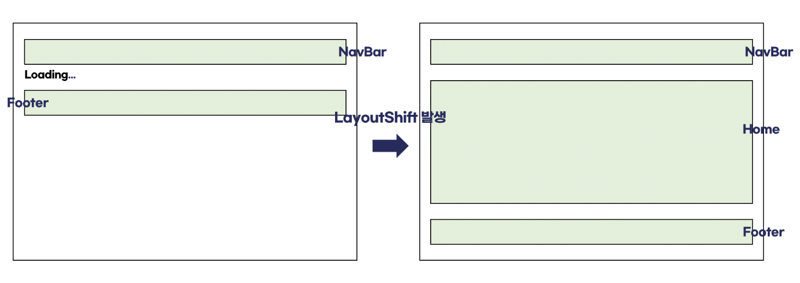

# Suspense와 친해지기

프로젝트를 진행하다 보면 Suspense를 한 번쯤은 사용하게 되는데 제대로 이해하고 사용하고 있는지 되돌아 보고, Suspense에 대해 아예 무지한 사람도 쉽게 이해할 수 있도록 차근차근 알아가 보겠습니다.

### Suspense란,

---

Suspense란, 리액트에서 비동기 작업이 완료될 때 까지 대체 컴포넌트를 보여주고, 작업이 완료되면 실제 컴포넌트로 교체해주는 기능입니다. 웹사이트에서 데이터를 불러오기 전, 흔히 보게 되는 로딩 애니메이션이나 메시지가 바로 이 Suspense를 통해 구현됩니다.



### Suspense 기본 문법

---

Suspense는 두 가지 주요 props를 받습니다. 첫 번째는 Promise를 catch 했을 때, 보여줄 fallback UI이고, 두 번째는 Promise를 던질 자식 컴포넌트입니다. 즉, fallback 속성에는 로딩 중에 표시될 컴포넌트를 지정하고, children에는 비동기 작업을 수행하는 자식 컴포넌트를 배치합니다.

```tsx
<Suspense fallback={<Loading />}>{children}</Suspense>
```

#### Props

- children : 렌더링하려는 실제 UI. 비동기 작업이 완료되면 화면에 표시.
- fallback : 로딩이 완료되지 않은 경우 실제 UI 대신 렌더링할 대체 UI.

예를 들어 리뷰 목록을 불러오는 리뷰 목록 페이지에서 비동기 작업이 있는 컴포넌트(ReviewList)를 Suspense로 감싸주고, 비동기 작업 중에는 fallback UI를 전달합니다. 즉, 데이터가 로딩되는 동안에는 Loading 컴포넌트가 화면에 표시되고, 로딩이 완료되면 ReviewList 컴포넌트가 화면에 렌더링됩니다.

```tsx
const Loading = () => {
  return <div>Loading...</div>;
};

const ReviewListPage = () => {
  return (
    <Suspense fallback={<Loading />}>
      <ReviewList />
    </Suspense>
  );
};
```

Suspense는 비동기 작업이 이루어지는 동안 컴포넌트 렌더링을 “일시 중단"하는 방식으로 동작합니다. 여기서 비동기 작업이란? 특정 작업이 끝날때 까지 기다리지 않고 다음 작업을 실행하는 방식을 의미합니다. 그러면 이 비동기 작업이 완료된다는 것을 어떻게 알 수 있을까요?

### Suspense는 비동기 작업의 상태를 어떻게 감지할까?

그 핵심은 Suspense로 감싸진 하위 컴포넌트가 Promise를 throw하는 방식에 있습니다.

| 상태          | 이미지                                 | 설명                                                                                                                                                                                                                                                                                                                                |
| ------------- | -------------------------------------- | ----------------------------------------------------------------------------------------------------------------------------------------------------------------------------------------------------------------------------------------------------------------------------------------------------------------------------------- |
| **Pending**   |    | 비동기 작업을 수행 중인 컴포넌트는 데이터를 가져오는 과정에서 Promise를 throw합니다. throw된 Promise는 Suspense에 의해 catch되며, 이후 Suspense는 이 Promise가 이행될 때까지 렌더링을 일시 중단합니다. 쉽게 말하면, "아직 준비 안 됐으니 좀 기다려봐라"라고 신호를 보내면 Suspense가 "오케이, 기다릴게"하며 로딩 화면을 보여줍니다. |
| **Fulfilled** |  | 비동기 작업이 완료되면 Promise는 fulfilled 상태가 되고, Suspense는 로딩 UI를 제거한 후 하위 컴포넌트를 렌더링합니다. 데이터를 다 가져왔으니 화면을 보여줘도 되겠구나라고 판단한 Suspense가 로딩 화면을 지우고, 실제 화면을 보여줍니다.                                                                                              |
| **Rejected**  |   | 비동기 작업이 실패하면 Promise는 rejected 상태가 되며, Suspense 자체가 실패 상태를 처리하지 않지만, 컴포넌트 내부에서 에러 경계를 사용하여 에러를 처리할 수 있습니다.                                                                                                                                                               |

### Suspense 사용 이유

---

Suspense를 적절히 사용하면 사용자 경험을 향상시킬 수 있습니다. 몇 가지 장점들을 살펴보겠습니다.

### 데이터 로딩 처리

사용자가 데이터를 기다리는 동안 아무것도 표시되지 않으면 사이트가 느리거나 문제가 있다고 느낄 수 있습니다. 대신 스켈레톤 UI를 사용함으로써 데이터가 로드될 것이라는 시각적 단서를 얻을 수 있습니다. 또한, Suspense를 활용하면 데이터가 로드되지 않았을 때도 일관된 레이아웃을 유지할 수 있어 Layout Shift를 방지할 수 있습니다.

| 티빙 스켈레톤 UI                                           |
| ---------------------------------------------------------- |
|  |

React Suspense는 React 18부터 정식 출시된 기능입니다. 기존에는 로딩 상태를 관리하기 위해 복잡한 조건부 렌더링이 필요했습니다. 다음은 조건부 렌더링으로 로딩 상태를 관리하는 코드 예시입니다.

```tsx
// 조건부 렌더링으로 로딩 상태 관리
const ReviewListPage = () => {
  // useGetReviewList 훅을 통해 비동기적으로 데이터를 가져옵니다.
  const { data, isLoading } = useGetReviewList();

  if (isLoading) {
    return <div>Loading...</div>;
  }

  return <div>{data}</div>;
};

const App = () => {
  return <ReviewListPage />;
};
```

조건부 렌더링은 각 컴포넌트가 비동기 작업을 처리해야 할 때, 로딩 상태를 직접 처리해야 하므로 중복 코드가 발생하기 쉽고, 프로젝트가 커질수록 로딩 상태를 관리하는 코드가 점점 더 복잡해질 수 있습니다. Suspense를 사용하면 한 곳에서 로딩 상태를 처리하고, 여러 컴포넌트에 일관된 방식으로 적용할 수 있습니다. 이렇게 하면 로직이 분리되어 중복이 줄어들고 유지보수가 용이해집니다.

```tsx
// Suspense 사용
const ReviewListPage = () => {
  const { data, isLoading } = useGetReviewList();

  return <div>{data}</div>;
};

const App = () => {
  return (
    <Suspense fallback={<div>Loading...</div>}>
      <ReviewListPage />
    </Suspense>
  );
};
```

참고로 useGetReviewList 훅에서 useSuspenseQuery를 이용해 데이터를 받아오는데 useSuspenseQuery란 무엇일까요

```
useSuspenseQuery는 TanStack Query 라이브러리의 훅으로, React의 Suspense 기능과 함께 작동하도록 설계되어 비동기 데이터 fetching을 효과적으로 관리합니다. 이 훅은 여러 쿼리를 병렬로 수행할 수 있는 기능을 제공하고, 데이터 로딩 상태를 간편하게 처리할 수 있게 해줍니다.
```

### Suspense 사용 예제

> 만약 하나의 Suspense가 여러개의 컴포넌트를 감싸고 있다면 어떻게 될까요?

기본적으로 Suspense는 내부의 모든 컴포넌트를 하나의 단위로 처리합니다. 내부 컴포넌트 중 하나라도 지연이 발생하면, 모든 요소가 동시에 로딩 표시로 대체됩니다. Biography와 Albums 컴포넌트의 데이터 패칭이 모두 완료되었을 때에만 해당 컴포넌트들이 화면에 나타나게 됩니다. 이때 주의할 점은, Suspense는 Effect나 이벤트 핸들러 내부에서의 비동기 작업 상태를 감지하지 못한다는 것입니다. 예를 들어, useEffect를 사용해 비동기 작업을 수행하는 경우, Suspense는 비동기 작업이 언제 완료되는지 알 수 없기 때문에 해당 작업의 상태를 처리할 수 없어 fallback UI를 보여주지 못하게 됩니다.

```tsx
  <Header />
    <Suspense fallback={<Spinner />}>
      <Biography />
      <Panel>
        <Albums />
      </Panel>
    </Suspense>
  <Footer />
```

 

> Suspense가 중첩되어 있다면 어떻게 될까요?

컴포넌트가 데이터 로딩으로 인해 일시 중단되면, 가장 가까운 상위 Suspense 컴포넌트가 해당 컴포넌트의 Fallback UI를 보여줍니다. 특정 컴포넌트가 다른 컴포넌트를 기다리지 않고도 로딩 UI를 표시할 수 있게 해 줍니다. 즉, Biography 컴포넌트가 Albums 컴포넌트를 기다리지 않아도 됩니다.

```tsx
<Header />
  <Suspense fallback={<BigSpinner />}>
    <Biography />
    <Suspense fallback={<AlbumsGlimmer />}>
      <Panel>
        <Albums />
      </Panel>
    </Suspense>
  </Suspense>
<Footer />
```

 

| 설명                                                                                   | 이미지                                                        |
| -------------------------------------------------------------------------------------- | ------------------------------------------------------------- |
| 1. Biography가 로드 되지 않은 경우, BigSpinner가 그 내부 컴포넌트를 대체합니다.        |  |
| 2. Biography의 데이터 패칭이 완료되면 BigSpinner 대신 Biography 컴포넌트가 표시됩니다. |  |
| 3. Albums의 데이터 패칭이 완료되면 AlbumsGlimmer 대신 Albums 컴포넌트가 표시됩니다.    |  |

#### 코드 스플리팅

lazy, suspense를 이용해 해당 페이지에 필요한 파일만을 불러옴으로써 초기 로딩 속도를 개선할 수 있습니다.

> React.lazy는 컴포넌트를 동적으로 가져오는 기능으로, 이 함수는 Promise를 반환하는 함수를 인자로 받습니다. 이를 통해 사용자는 처음 앱을 로드할 때 모든 컴포넌트를 미리 가져오는 것이 아니라, 실제로 필요할 때만 해당 컴포넌트를 로드하게 됩니다.

페이지가 로드될 때 모든 컴포넌트를 가져오는 대신, 사용자가 필요로 하는 컴포넌트만 로드하므로 초기 번들의 크기를 줄일 수 있습니다. 그리고 사용자가 특정 페이지를 요청할 때, 해당 페이지에 필요한 리소스만 가져오기 때문에 초기 로딩 속도를 향상시킬 수 있습니다.

```tsx
const Home = lazy(() => import("./pages/Home/Home"));
const Search = lazy(() => import("./pages/Search/Search"));

const App = () => {
  return (
    <Router>
      <NavBar />
      <Suspense fallback={<div>Loading...</div>}>
        <Routes>
          <Route path="/" element={<Home />} />
          <Route path="/search" element={<Search />} />
        </Routes>
      </Suspense>
      <Footer />
    </Router>
  );
};
```

#### ❗️ LayoutShift

Suspense 컴포넌트는 fallback 속성을 사용하여 비동기 로딩이 진행 중일 때 대체 UI를 표시합니다. 이때, NavBar와 Footer는 먼저 렌더링되지만, Home 컴포넌트는 비동기 로드가 완료되기 전까지 로딩 UI를 보여주게 됩니다. 문제는 이 과정에서 화면이 재배치되는 "LayoutShift" 현상이 발생한다는 점입니다.

예를 들어, 사용자가 Home 페이지에 접근할 때 NavBar는 먼저 나타나고, Home 컴포넌트가 아직 로드되지 않아 로딩 UI가 표시됩니다. 이후 Home 컴포넌트가 모두 불러와지면 그 크기만큼 화면이 갑자기 커지게 되므로 LayoutShift 현상이 발생하게 됩니다.

 

로딩 UI가 뷰포트 전체를 차지하게 설정함으로써, LayoutShift 현상을 방지할 수 있습니다. NavBar와 Footer는 페이지 로딩 중에도 동일한 위치에 유지되며, Home 컴포넌트가 로드된 후에만 실제 콘텐츠가 나타나기 때문에, 화면 요소의 이동이나 크기 변화 없이 부드럽게 로딩이 이루어집니다. 이렇게 구현하면 로딩 UI를 보면서도 예상치 못한 레이아웃 변화 없이 페이지가 로드될 수 있습니다.

```tsx
// 개선 후
const Home = lazy(() => import("./pages/Home/Home"));
const Search = lazy(() => import("./pages/Search/Search"));

const App = () => {
  return (
    <Router>
      <NavBar />
      <Suspense fallback={<div style={{ width: "100vw", height: "100vh" }}>Loading...</div>}>
        <Routes>
          <Route path="/" element={<Home />} />
          <Route path="/search" element={<Search />} />
        </Routes>
      </Suspense>
      <Footer />
    </Router>
  );
};
```

## 참고

- [리액트 공식 문서 - Suspense](https://ko.react.dev/reference/react/Suspense)
- https://github.com/reactwg/react-18/discussions/37
- https://www.jungmin.me/post/react-%EB%A1%9C%EB%94%A9%EC%B2%98%EB%A6%AC%EC%99%80-suspense-%EB%93%B1%EC%9E%A5
- https://dev.to/hxxtae/how-to-used-suspense-5hfd
- https://syjn99.medium.com/react-suspense%EB%9E%80-557a7d3ecd45
